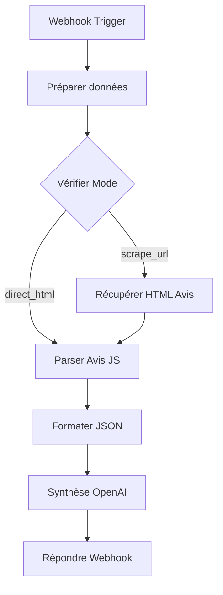

# Architecture technique - Amazon Reviews Scraper

## Vue d'ensemble

Le workflow est composé de 8 nodes interconnectés qui forment un pipeline de traitement des avis Amazon.

## Diagramme Mermaid



## Détail des nodes

### 1. Webhook Trigger

| Propriété | Valeur |
|-----------|--------|
| **ID** | `webhook-trigger` |
| **Type** | `n8n-nodes-base.webhook` |
| **Version** | 2 |
| **Méthode** | POST |
| **Path** | `/amazon-reviews` |
| **Response Mode** | responseNode |

**Fonction:** Point d'entrée du workflow. Reçoit les requêtes HTTP POST contenant soit le HTML direct, soit une URL Amazon.

---

### 2. Préparer données

| Propriété | Valeur |
|-----------|--------|
| **ID** | `extract-product-url` |
| **Type** | `n8n-nodes-base.code` |
| **Version** | 2 |
| **Langage** | JavaScript |

**Fonction:** Analyse le body de la requête et détermine le mode d'opération :
- `direct_html` : Si le champ `html` est présent
- `scrape_url` : Si un lien Amazon est fourni

**Logique principale:**
```javascript
// Mode 1: HTML fourni directement
if (body.html) {
  return [{ json: { mode: 'direct_html', html: body.html, ... } }];
}

// Mode 2: URL fournie (scraping)
// Extrait l'ASIN et construit l'URL des avis
```

---

### 3. Vérifier Mode

| Propriété | Valeur |
|-----------|--------|
| **ID** | `if-mode-check` |
| **Type** | `n8n-nodes-base.if` |
| **Version** | 2.2 |

**Fonction:** Routage conditionnel basé sur le mode détecté.

| Sortie | Condition | Destination |
|--------|-----------|-------------|
| Output 0 | `mode === 'direct_html'` | Parser Avis JS |
| Output 1 | `mode === 'scrape_url'` | Récupérer HTML Avis |

---

### 4. Récupérer HTML Avis

| Propriété | Valeur |
|-----------|--------|
| **ID** | `http-request-reviews` |
| **Type** | `n8n-nodes-base.httpRequest` |
| **Version** | 4.3 |

**Fonction:** Effectue une requête HTTP GET vers l'URL des avis Amazon.

**Headers configurés:**
| Header | Valeur |
|--------|--------|
| User-Agent | Mozilla/5.0 (Windows NT 10.0; Win64; x64) Chrome/120.0.0.0 |
| Accept | text/html,application/xhtml+xml |
| Accept-Language | fr-FR,fr;q=0.9,en-US;q=0.8 |

**Note:** Ce node est actuellement bloqué par les protections CAPTCHA d'Amazon.

---

### 5. Parser Avis JS

| Propriété | Valeur |
|-----------|--------|
| **ID** | `parse-reviews-bs4` |
| **Type** | `n8n-nodes-base.code` |
| **Version** | 2 |
| **Langage** | JavaScript |

**Fonction:** Parse le HTML Amazon pour extraire les avis individuels.

**Données extraites par avis:**
| Champ | Regex utilisée |
|-------|----------------|
| `author` | `/class="a-profile-name">([^<]+)<\/span>/g` |
| `rating` | `/a-icon-alt">([\d,\.]+)\s*sur\s*5/g` |
| `title` | `/review-title-content[^>]*a-text-bold[^>]*>[\s\S]*?<span>([^<]+)<\/span>/g` |
| `date` | `/data-hook="review-date"[^>]*>([^<]+)</g` |
| `text` | `/review-text-content">\s*<span>([\s\S]*?)<\/span>/g` |

---

### 6. Formater JSON

| Propriété | Valeur |
|-----------|--------|
| **ID** | `format-json` |
| **Type** | `n8n-nodes-base.code` |
| **Version** | 2 |

**Fonction:** Restructure les données dans un format propre et standardisé.

**Structure de sortie:**
```javascript
{
  product: { url, asin, reviews_url },
  metadata: { scraped_at, total_reviews },
  reviews: [{ title, rating, author, date, text, ... }]
}
```

---

### 7. Synthèse OpenAI

| Propriété | Valeur |
|-----------|--------|
| **ID** | `openai-synthesis` |
| **Type** | `@n8n/n8n-nodes-langchain.openAi` |
| **Version** | 2.1 |
| **Modèle** | gpt-4o-mini |
| **Max Tokens** | 1000 |

**Fonction:** Analyse les avis et génère une synthèse structurée.

**System Prompt:**
```
Tu es un expert en analyse de produits. Tu reçois des avis clients Amazon
et tu dois produire une synthèse structurée en français.

Format de sortie JSON:
{
  "note_moyenne": number,
  "nombre_avis": number,
  "points_positifs": ["..."],
  "points_negatifs": ["..."],
  "resume": "Un paragraphe de synthèse globale",
  "recommandation": "Acheter / À éviter / Mitigé"
}
```

---

### 8. Répondre Webhook

| Propriété | Valeur |
|-----------|--------|
| **ID** | `respond-webhook` |
| **Type** | `n8n-nodes-base.respondToWebhook` |
| **Version** | 1.1 |
| **Format** | JSON |

**Fonction:** Renvoie la réponse finale au client HTTP.

---

## Flux de données

```
Requête POST
     │
     ▼
┌─────────────────────────────────────────────────────┐
│ body: { html: "..." } ou { link: "..." }            │
└─────────────────────────────────────────────────────┘
     │
     ▼
┌─────────────────────────────────────────────────────┐
│ { mode, html, reviewsUrl, asin, timestamp }         │
└─────────────────────────────────────────────────────┘
     │
     ▼
┌─────────────────────────────────────────────────────┐
│ { reviews_count, reviews: [...], scraped_at }       │
└─────────────────────────────────────────────────────┘
     │
     ▼
┌─────────────────────────────────────────────────────┐
│ { product: {...}, metadata: {...}, reviews: [...] } │
└─────────────────────────────────────────────────────┘
     │
     ▼
┌─────────────────────────────────────────────────────┐
│ { note_moyenne, points_positifs, recommandation }   │
└─────────────────────────────────────────────────────┘
```

## Connexions

| Source | Destination | Type | Index |
|--------|-------------|------|-------|
| Webhook Trigger | Préparer données | main | 0 |
| Préparer données | Vérifier Mode | main | 0 |
| Vérifier Mode (true) | Parser Avis JS | main | 0 |
| Vérifier Mode (false) | Récupérer HTML Avis | main | 0 |
| Récupérer HTML Avis | Parser Avis JS | main | 0 |
| Parser Avis JS | Formater JSON | main | 0 |
| Formater JSON | Synthèse OpenAI | main | 0 |
| Synthèse OpenAI | Répondre Webhook | main | 0 |
